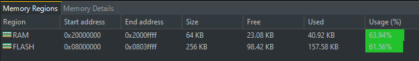

# Table of contents
- [Table of contents](#table-of-contents)
- [Pet food dispenser introduction](#pet-food-dispenser-introduction)
- [Project features](#project-features)
- [Welcome screen](#welcome-screen)
- [Settings screen](#settings-screen)
- [App configuration](#app-configuration)
- [Board project layout](#board-project-layout)
- [Memory consumption](#memory-consumption)

# Pet food dispenser introduction
This project is based on the STM32F401 microcontroller and freeRTOS,
it can be applied to any STM32 microcontroller that uses HAL layer with just
minimal changes.

The development board used to test it was the **Songhe STM32F401** which is
the previous version of the actual **black pill** development board so if you
have the black pill would be easy to implement the whole project

# Project features
* Heart beat LED 
* Display ili9341
* Debug port at 9600 8-N-1
* Buzzer (1 kHz square signal)
* Servomotor to move a gate and dispense food portions. (PWM signal according to tomerpro MG995 servomotor)
* Three push buttons (Enter, UP and DOWN), debounce issue by software
* Backlight is turned off after 1 min of inactivity (can be changed in appConfig header)

# Welcome screen 
The default screen on the project allows you to feed your pet by pressing button enter. The number of portions is configured in settings.

# Settings screen

In settings, you can configure the number of portions up to 5 (max value can be changed in appConfig.h) and turn on or off the system sound. 

# App configuration

In *appConfig.h* you will find C macros to configure the application and peripheral configurations. This is the place you must to change if you want to implement the app in a different microcontroller or development board.

# Board project layout

# Memory consumption

# Demo
https://github.com/aaron-ev/food-dispenser/assets/84993491/ca16c7d8-9e9b-4d37-beca-97fde8cc137a

